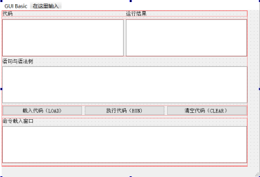
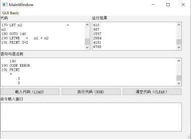

#Basic Interpreter
## 一、项目介绍

	这是一个Basic语言解释器。

## 二、系统设计

### 1.内核类

本软件主要分为界面类、表达式树类和通用功能函数接口。

 

#### (1)表达式树类

```
	class tree_node{
    public:
    string operator_string = "pureValue";
    string variable_name = "";
    int value_1 = 0;
    int value_2 = 0;
    int level = 1;
    int ans = 0;
    tree_node* left_tree = nullptr, *right_tree = nullptr;
	}
```
	表达式树类的定义如上所示，定义了左值和右值、操作符、左子树和右子树。如果一个节点不由任何运算派生，则运算符设置为pureValue。

### 2.图形界面

图形界面提供了Basic解释器的图形化实现，包括代码、运行结果、语句和语法树以及命令载入窗口。



## 三、程序逻辑

程序启动后，可以选择从硬盘中载入代码、或者从命令载入窗口手动加载代码。如果代码中有序号，则加入到代码区等待执行。如果代码中不含序号，则直接将执行保存到程序内存中并将对应的结果显示在运行结果中。



图 1 代码执行结果

在代码执行环节中，程序首先逐行读入指令进行语法解析，逐行创建语法树，如果解析到非法命令，会输出CODE ERROR，并继续解析下一行指令。最终将结果打印在语句和语法树中。

语法解析完成后，程序会开始模拟Basic执行。期间，如果存在INPUT指令。程序模拟执行会中断，等待命令行输入合法的表达式后，再继续模拟执行。

## 四、待修复BUG

	1. 代码运行后，代码显示框内可能导致部分LET语句不同程度错位的情况。这是因为为了流运算的简便，自动使用“ = ”替代“=”时，出现了多次替换的情况。
	
	2. 代码运行后，使用LET命令行直接产生的变量和代码运行过程中产生的变量无法在同一个表达式中进行运算。（单独LET命令行产生的和单独代码运行过程中产生的变量的表达式可以运算）原因未知。
	
	3. 在载入代码前，如果已经使用命令行的INPUT语句加载了部分变量，可能出现加载外部代码时程序崩溃的情况。目前推荐使用LOAD按钮前，先使用CLEAR清空所有程序中的内存。
	
	4. 目前的程序设计基本上没有按照面向对象设计的思想，大量模块紧耦合、存在函数的互相调用、存在全局变量的复杂引用，在basic v2中会重构代码。